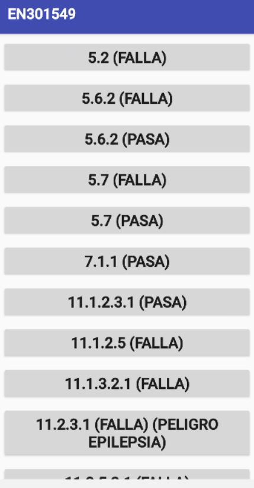

# Aplicación EN301549

Con esta aplicación para Android se pueden revisar requisitos de accesibilidad establecidos en la norma EN 301 549, para los que es difícil encontrar en el mercado aplicaciones móviles en las que sean aplicables.
Concretamente los siguientes requisitos:
- 5.2 Activación de características de accesibilidad
- 5.6.2 Estado visual
- 5.7 Repetición de caracteres de teclado
- 7.1.1 Reproducción del subtitulado
- 11.1.2.3.1 Audiodescripción o contenido multimedia alternativo (grabado - funcionalidad abierta)
- 11.1.2.5 Audiodescripción (grabado)
- 11.1.3.2.1 Secuencia significativa (funcionalidad abierta)
- 11.2.3.1 Umbral de tres destellos o menos
- 11.2.5.3.1 Inclusión de la etiqueta en el nombre (funcionalidad abierta)
- 11.3.2.1 Al recibir el foco
- 11.3.2.2 Al recibir entradas
- 11.4.1.1.1 Procesamiento (funcionalidad abierta)
